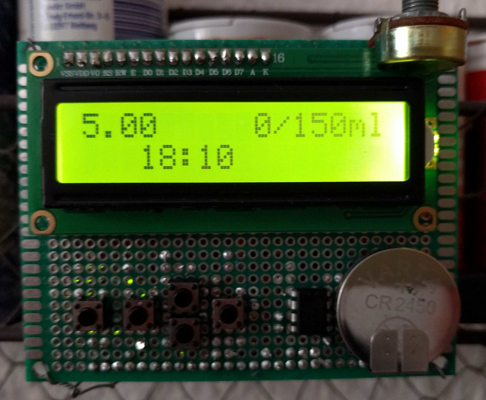
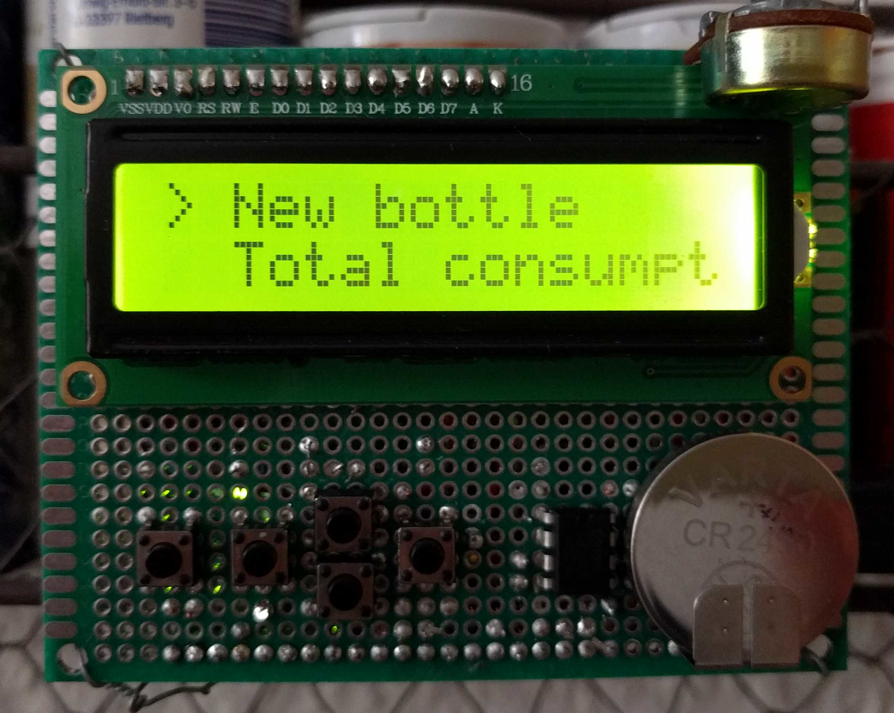

# Features

- Keeps track of all bottles served to your baby
- Automatic calculation of the overall volume and powder mass consumed
  within the last 24 hours
- Takes the volume added by the milk powder into account when
  calculating the total consumption (let's not be too critical with them)
- Easy and menu-based design
- Minimal power consumption via Arduino and automatic power off of the
  LCD display

# Overview

`bottler` is an Arduino-based software which helps you keep track of
all the bottles you prepared for your infant (and helps you with the
paranoia it didn't drank enough again).

It is built on a couple of different view showing
- a detailed view of each bottle consisting (from top-left to
  bottom-right) of the spoons used, the remaining volume, the original
  volume, and the time the bottle was prepared at
- a menu allowing you to switch between the different views
- a view to add a new bottle
- a view displaying the total consumption within 24hours in terms of
  volume and mass of milk powder
- a view to set the local time in case no RTC chip is present

The navigation is done by five buttons. 
- the leftmost is opening the menu
- the second one from the left is used to go back to the previous
  view - with the current bottle view being the default one - and to
  cancel an insertion
- the rightmost is used to select a view and to confirm an insertion
- the two vertically arranged ones are used to increase/decrease a
  value and to navigate the menu and bottle lists

# Requirements

The software was tested on

- Arduino Uno (unfortunately the sketch is to large for this version
  to include the RTC library)
- Arduino Mega 2540

in combination with a 
- [LCD Keypad shield](https://wiki.dfrobot.com/Arduino_LCD_KeyPad_Shield__SKU__DFR0009_)
- a custom shield including an additional RTC1307 chips + battery and
  support to control the backlight of the LCD display using a digital
  pin of the Arduino
